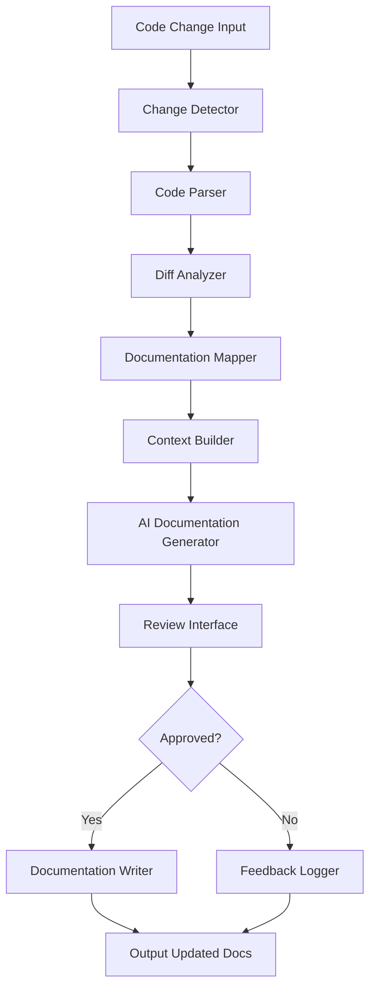
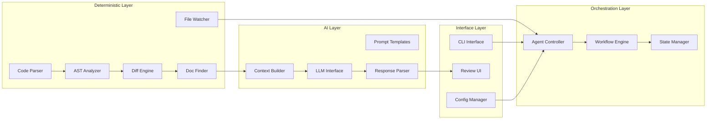

# Design Document: Documentation Maintenance Agent

## Overview

The Documentation Maintenance Agent is built using a hybrid agent architecture that combines deterministic code analysis with AI-powered natural language generation. The system follows a pipeline pattern where each stage processes information and passes it to the next, with clear separation between algorithmic operations and AI reasoning.

The agent operates in three main phases:
1. **Detection Phase** (Deterministic): Parse code, detect changes, identify affected APIs
2. **Mapping Phase** (Deterministic + AI): Find documentation references, understand context
3. **Generation Phase** (AI): Generate updated documentation while preserving style and accuracy

**Version 1 Focus**: This design prioritizes learning and understanding agent concepts. V1 is a manual CLI tool that works with in-repo documentation (`/docs` folder and `README.md`), uses git to detect changes, and provides interactive review of all updates. This keeps the scope manageable while demonstrating the full hybrid agent pattern.

**Future Versions**: V2 adds git hook automation, V3 adds PR integration for team workflows.

## Architecture

### High-Level Architecture



### Agent Pipeline Architecture

The agent follows a **ReAct-inspired pattern** (Reasoning + Acting) but simplified for this specific domain:

1. **Observe**: Detect what changed in the code
2. **Reason**: Determine which documentation is affected and why
3. **Act**: Generate updated documentation
4. **Reflect**: Present changes for human review

### Component Architecture



## Components and Interfaces

### 1. Change Detector

**Purpose**: Monitor code changes and trigger the agent pipeline

**Responsibilities**:
- Watch for file system changes or git commits
- Filter changes based on configuration (file patterns, directories)
- Extract changed files and pass to Code Parser

**Interface**:
```typescript
interface ChangeDetector {
  // Initialize with configuration
  initialize(config: AgentConfig): void;
  
  // Detect changes from git diff
  detectFromGit(commitHash?: string): Promise<CodeChange[]>;
  
  // Detect changes from file paths
  detectFromFiles(filePaths: string[]): Promise<CodeChange[]>;
  
  // Watch for real-time changes
  watch(callback: (changes: CodeChange[]) => void): void;
}

interface CodeChange {
  filePath: string;
  changeType: 'added' | 'modified' | 'deleted';
  language: string;
  content: string;
  previousContent?: string;
}
```

### 2. Code Parser

**Purpose**: Parse code files into Abstract Syntax Trees (AST) for analysis

**Responsibilities**:
- Detect programming language from file extension
- Parse code into AST using language-specific parsers
- Extract API elements (functions, classes, types, exports)
- Handle parsing errors gracefully

**Interface**:
```typescript
interface CodeParser {
  // Parse a code file
  parse(code: string, language: string): Promise<ParsedCode>;
  
  // Extract API elements from AST
  extractAPIs(ast: AST): APIElement[];
  
  // Get supported languages
  getSupportedLanguages(): string[];
}

interface ParsedCode {
  ast: AST;
  apis: APIElement[];
  imports: ImportStatement[];
  exports: ExportStatement[];
}

interface APIElement {
  type: 'function' | 'class' | 'interface' | 'type' | 'constant';
  name: string;
  signature: string;
  location: SourceLocation;
  isPublic: boolean;
  documentation?: string;
  parameters?: Parameter[];
  returnType?: string;
}
```

**Implementation Notes**:
- Use `@babel/parser` for JavaScript/TypeScript
- Use `ast` module for Python
- Store parser instances in a registry pattern for extensibility

### 3. Diff Analyzer

**Purpose**: Compare old and new code versions to identify specific changes

**Responsibilities**:
- Compare two ASTs to find differences
- Classify changes (added, removed, modified, signature change)
- Determine if changes affect public API
- Calculate change severity

**Interface**:
```typescript
interface DiffAnalyzer {
  // Analyze differences between two parsed code versions
  analyze(oldCode: ParsedCode, newCode: ParsedCode): APIDiff;
  
  // Determine if a change affects public API
  isPublicAPIChange(diff: APIDiff): boolean;
  
  // Calculate severity of changes
  calculateSeverity(diff: APIDiff): ChangeSeverity;
}

interface APIDiff {
  added: APIElement[];
  removed: APIElement[];
  modified: ModifiedAPI[];
  unchanged: APIElement[];
}

interface ModifiedAPI {
  old: APIElement;
  new: APIElement;
  changes: ChangeDetail[];
}

interface ChangeDetail {
  type: 'signature' | 'parameters' | 'return_type' | 'documentation';
  description: string;
}

type ChangeSeverity = 'breaking' | 'major' | 'minor' | 'patch';
```

### 4. Documentation Mapper

**Purpose**: Find all documentation files that reference changed code

**Responsibilities**:
- Search documentation directories for references
- Parse documentation files (Markdown, MDX)
- Extract code examples and API references
- Build a map of code elements to documentation locations

**Interface**:
```typescript
interface DocumentationMapper {
  // Find documentation files that reference an API element
  findReferences(apiElement: APIElement): Promise<DocReference[]>;
  
  // Search for code examples that use the API
  findCodeExamples(apiElement: APIElement): Promise<CodeExample[]>;
  
  // Build a complete map of affected documentation
  mapAffectedDocs(diff: APIDiff): Promise<AffectedDocumentation>;
}

interface DocReference {
  filePath: string;
  lineNumber: number;
  context: string;
  referenceType: 'name' | 'example' | 'description';
}

interface CodeExample {
  filePath: string;
  code: string;
  language: string;
  startLine: number;
  endLine: number;
}

interface AffectedDocumentation {
  files: Map<string, DocFile>;
  totalReferences: number;
  missingDocs: APIElement[];
}

interface DocFile {
  path: string;
  content: string;
  references: DocReference[];
  examples: CodeExample[];
}
```

**Implementation Notes**:
- Use regex patterns for initial reference detection
- Parse Markdown AST to understand structure
- Support code fence detection for examples
- Cache documentation index for performance

### 5. Context Builder

**Purpose**: Prepare rich context for the AI to generate accurate documentation updates

**Responsibilities**:
- Gather all relevant information about the change
- Extract surrounding code context
- Retrieve existing documentation style
- Build structured prompts for the LLM

**Interface**:
```typescript
interface ContextBuilder {
  // Build context for a documentation update
  buildContext(
    diff: APIDiff,
    affectedDocs: AffectedDocumentation,
    config: AgentConfig
  ): DocumentationContext;
  
  // Extract style guidelines from existing docs
  extractStyleGuide(docFiles: DocFile[]): StyleGuide;
}

interface DocumentationContext {
  codeChanges: APIDiff;
  affectedFiles: DocFile[];
  styleGuide: StyleGuide;
  projectContext: ProjectContext;
  examples: CodeExample[];
}

interface StyleGuide {
  tone: string;
  formatting: string;
  conventions: string[];
  examplePatterns: string[];
}

interface ProjectContext {
  language: string;
  framework?: string;
  documentationFormat: string;
  customGuidelines?: string;
}
```

### 6. AI Documentation Generator

**Purpose**: Use LLM to generate updated documentation that maintains style and accuracy

**Responsibilities**:
- Interface with LLM API (OpenAI, Anthropic, etc.)
- Generate prompts from context
- Parse and validate LLM responses
- Handle retries and errors

**Interface**:
```typescript
interface AIDocumentationGenerator {
  // Generate updated documentation for a specific file
  generateUpdate(
    docFile: DocFile,
    context: DocumentationContext
  ): Promise<DocumentationUpdate>;
  
  // Generate documentation for missing APIs
  generateNewDoc(
    apiElement: APIElement,
    context: DocumentationContext
  ): Promise<string>;
  
  // Validate generated documentation
  validate(update: DocumentationUpdate): ValidationResult;
}

interface DocumentationUpdate {
  filePath: string;
  originalContent: string;
  updatedContent: string;
  changes: ContentChange[];
  reasoning: string;
}

interface ContentChange {
  type: 'example' | 'description' | 'signature' | 'addition';
  startLine: number;
  endLine: number;
  oldContent: string;
  newContent: string;
}

interface ValidationResult {
  isValid: boolean;
  errors: string[];
  warnings: string[];
}
```

**Implementation Notes**:
- Use structured prompts with clear instructions
- Include few-shot examples in prompts
- Implement response parsing with fallbacks
- Add validation for code syntax in examples

### 7. Agent Controller

**Purpose**: Orchestrate the entire agent pipeline and manage workflow

**Responsibilities**:
- Coordinate all components
- Manage execution flow
- Handle errors and retries
- Maintain state across pipeline stages

**Interface**:
```typescript
interface AgentController {
  // Run the complete agent pipeline
  run(input: AgentInput): Promise<AgentResult>;
  
  // Run in interactive mode with user feedback
  runInteractive(input: AgentInput): Promise<AgentResult>;
  
  // Get current pipeline state
  getState(): AgentState;
}

interface AgentInput {
  mode: 'git' | 'files' | 'watch';
  target?: string; // commit hash or file paths
  config: AgentConfig;
}

interface AgentResult {
  success: boolean;
  updatesGenerated: number;
  updatesApplied: number;
  errors: Error[];
  summary: string;
}

interface AgentState {
  currentPhase: 'detecting' | 'mapping' | 'generating' | 'reviewing' | 'complete';
  progress: number;
  pendingReviews: DocumentationUpdate[];
}
```

### 8. Review Interface

**Purpose**: Present generated documentation updates to users for approval

**Responsibilities**:
- Display diffs in readable format
- Collect user feedback (approve/reject/edit)
- Log decisions for learning
- Support batch operations

**Interface**:
```typescript
interface ReviewInterface {
  // Present an update for review
  presentUpdate(update: DocumentationUpdate): Promise<ReviewDecision>;
  
  // Present multiple updates
  presentBatch(updates: DocumentationUpdate[]): Promise<ReviewDecision[]>;
  
  // Log review decision for learning
  logDecision(update: DocumentationUpdate, decision: ReviewDecision): void;
}

interface ReviewDecision {
  action: 'approve' | 'reject' | 'edit';
  editedContent?: string;
  feedback?: string;
}
```

### 9. Configuration Manager

**Purpose**: Manage agent configuration and user preferences

**Interface**:
```typescript
interface AgentConfig {
  // Paths
  documentationPaths: string[];
  codePaths: string[];
  ignorePaths: string[];
  
  // Behavior
  autoApprove: boolean;
  minSeverity: ChangeSeverity;
  generateMissingDocs: boolean;
  
  // AI Settings
  llmProvider: 'openai' | 'anthropic' | 'local';
  llmModel: string;
  temperature: number;
  
  // Style
  customStyleGuide?: string;
  documentationFormat: 'markdown' | 'mdx';
  
  // Execution
  mode: 'manual' | 'pre-commit' | 'post-commit' | 'ci';
}
```

## Data Models

### Core Data Flow

```
CodeChange → ParsedCode → APIDiff → AffectedDocumentation → 
DocumentationContext → DocumentationUpdate → ReviewDecision → 
Updated Documentation Files
```

### State Management

The agent maintains state throughout the pipeline:

```typescript
interface PipelineState {
  sessionId: string;
  startTime: Date;
  input: AgentInput;
  
  // Phase outputs
  detectedChanges?: CodeChange[];
  parsedCode?: Map<string, ParsedCode>;
  diffs?: APIDiff[];
  affectedDocs?: AffectedDocumentation;
  generatedUpdates?: DocumentationUpdate[];
  reviewDecisions?: ReviewDecision[];
  
  // Metrics
  metrics: {
    filesAnalyzed: number;
    apisChanged: number;
    docsUpdated: number;
    executionTime: number;
  };
}
```

## Error Handling

### Error Categories

1. **Parsing Errors**: Code cannot be parsed
   - Fallback: Skip file and log warning
   - User notification: Show which files were skipped

2. **LLM Errors**: API failures, rate limits, invalid responses
   - Retry with exponential backoff
   - Fallback: Queue for manual review
   - User notification: Show retry status

3. **File System Errors**: Cannot read/write files
   - Fail fast with clear error message
   - Rollback any partial changes

4. **Configuration Errors**: Invalid config
   - Validate on startup
   - Provide helpful error messages with examples

### Error Recovery Strategy

```typescript
interface ErrorHandler {
  handle(error: Error, context: ErrorContext): ErrorRecovery;
}

interface ErrorRecovery {
  action: 'retry' | 'skip' | 'fail' | 'fallback';
  retryCount?: number;
  fallbackValue?: any;
  userMessage: string;
}
```

## Testing Strategy

### Unit Testing

Each component should be independently testable:

- **Code Parser**: Test with sample code files in each supported language
- **Diff Analyzer**: Test with known before/after code pairs
- **Documentation Mapper**: Test with mock documentation files
- **AI Generator**: Test with mocked LLM responses
- **Agent Controller**: Test pipeline orchestration with mocked components

### Integration Testing

Test component interactions:

- **Parser → Diff Analyzer**: Ensure AST changes are correctly identified
- **Diff → Mapper**: Verify affected docs are found
- **Mapper → Generator**: Confirm context is properly built
- **End-to-end**: Run full pipeline with sample repositories

### Test Data

Create a test repository with:
- Sample code files (JS, TS, Python)
- Sample documentation with various reference styles
- Known changes and expected documentation updates

### Mocking Strategy

- Mock LLM responses for predictable testing
- Mock file system for isolated tests
- Use dependency injection for all external dependencies

### Test Coverage Goals

- Unit tests: 80%+ coverage
- Integration tests: Cover all happy paths and major error scenarios
- E2E tests: At least 3 complete scenarios (simple change, breaking change, missing docs)

## Performance Considerations

### Optimization Strategies

1. **Caching**:
   - Cache parsed ASTs for unchanged files
   - Cache documentation index
   - Cache LLM responses for identical contexts

2. **Parallel Processing**:
   - Parse multiple files concurrently
   - Generate documentation updates in parallel
   - Batch LLM requests when possible

3. **Incremental Analysis**:
   - Only analyze changed files
   - Skip unchanged documentation
   - Use git diff for efficient change detection

4. **Resource Limits**:
   - Limit concurrent LLM requests
   - Implement request queuing
   - Set timeouts for all async operations

### Performance Metrics

Track and log:
- Time per pipeline phase
- LLM token usage
- Files processed per second
- Cache hit rates

## Security Considerations

1. **API Key Management**:
   - Store LLM API keys in environment variables
   - Never log or expose keys
   - Support key rotation

2. **File System Access**:
   - Validate all file paths
   - Restrict access to configured directories
   - Prevent path traversal attacks

3. **Code Execution**:
   - Never execute generated code
   - Sandbox all parsing operations
   - Validate all user inputs

4. **Data Privacy**:
   - Allow opt-out of sending code to external LLMs
   - Support local LLM options
   - Log what data is sent to external services

## Deployment and Execution Modes

### Version 1: Manual CLI Tool (Learning Phase)

The initial version focuses on manual execution with interactive feedback, making it easy to understand how the agent works and debug issues.

```bash
# Analyze changes since last commit
doc-agent run

# Analyze specific files
doc-agent run --files src/api.ts src/utils.ts

# Analyze specific commit
doc-agent run --commit abc123
```

**V1 Scope**:
- Manual execution only
- Interactive review of all changes
- In-repo documentation only (`/docs` folder and `README.md`)
- Git-aware change detection
- Local file system operations

### Version 2: Git Hook Integration (Future)

Once comfortable with the agent behavior, add automated triggers.

```bash
# Install as post-commit hook
doc-agent install --hook post-commit
```

**V2 Additions**:
- Automatic execution on commit
- Optional auto-approve for minor changes
- Background processing

### Version 3: PR Integration (Future)

For team workflows, integrate with pull request process.

```yaml
# GitHub Actions example
- name: Update Documentation
  run: |
    doc-agent run --ci
    doc-agent create-pr
```

**V3 Additions**:
- Run on PR creation/update
- Create separate PR with doc updates
- Team review workflow

### Configuration File

`.doc-agent.config.json`:
```json
{
  "documentationPaths": ["docs/**/*.md", "README.md"],
  "codePaths": ["src/**/*.ts", "src/**/*.js"],
  "ignorePaths": ["node_modules/**", "dist/**", "test/**"],
  "minSeverity": "minor",
  "llmProvider": "openai",
  "llmModel": "gpt-4-turbo",
  "temperature": 0.3,
  "autoApprove": false
}
```

**V1 Configuration Priorities**:
- Simple, sensible defaults
- Easy to understand and modify
- Focus on common JavaScript/TypeScript projects
- Conservative AI settings (low temperature for consistency)

## Future Enhancements

Potential additions for future iterations:

1. **Learning from Feedback**: Train a fine-tuned model on approved/rejected updates
2. **Multi-language Documentation**: Generate docs in multiple languages
3. **Visual Documentation**: Update diagrams and screenshots
4. **Semantic Versioning**: Suggest version bumps based on API changes
5. **Documentation Quality Metrics**: Score documentation completeness and clarity
6. **Integration with Documentation Platforms**: Direct integration with GitBook, Docusaurus, etc.
